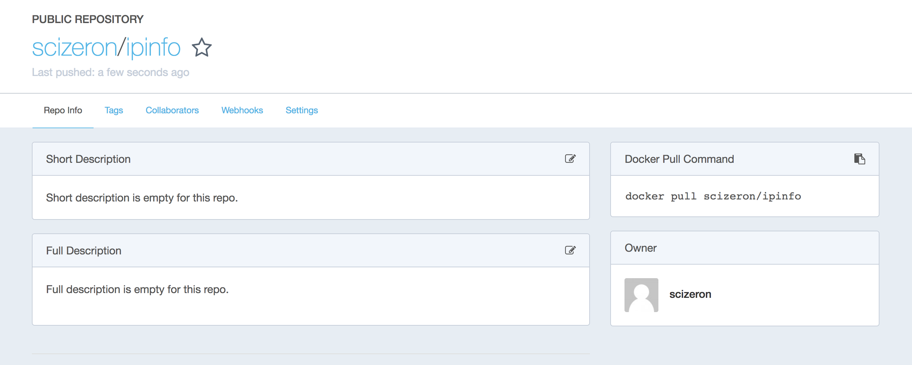

## Ipinfo

[](https://travis-ci.org/scizeron/ipinfo)
[](https://codecov.io/github/scizeron/ipinfo?branch=develop)

---

## Table of Contents

- [Java](#java)
  * Build
  * Run
- [Docker](#docker)
  * Build
  * Run
  * Push
  * Swarm   
- [Demo](#demo)

---

## Java

### Build

```sh
mvn clean install
```

### Run

Behind a corporate proxy

```sh
java -Djava.net.preferIPv4Stack=true -Dhttp.proxyHost=$PROXY_HOST -Dhttp.proxyPort=$PROXY_PORT -jar target/app.jar  
```

To simulate a remote client, populate the http request header X-FORWARDED-FOR with a public IP.

```sh
curl -H X-FORWARDED-FOR:$(curl -s icanhazip.com) http://localhost:8080
```

---

## Docker

### Build

```sh
docker build -t scizeron/ipinfo .
```

### Run

Behind a corporate proxy

```sh
docker run -d -p8080:8080 -e "JAVA_OPTS=-Djava.net.preferIPv4Stack=true -Dhttp.proxyHost=$PROXY_HOST -Dhttp.proxyPort=$PROXY_PORT" scizeron/ipinfo
```

### Push

Push the docker image on hub.docker.com (docker login)

```sh
docker push scizeron/ipinfo
```

See all tags [here](https://hub.docker.com/r/scizeron/ipinfo/tags/).



### Swarm

```sh
docker service create --name ipinfo --replicas 1 --publish 8080:8080 scizeron/ipinfo
```

---

## Demo

[Here](https://azure-api.scizeron-dev.com/v2/ipinfo)
