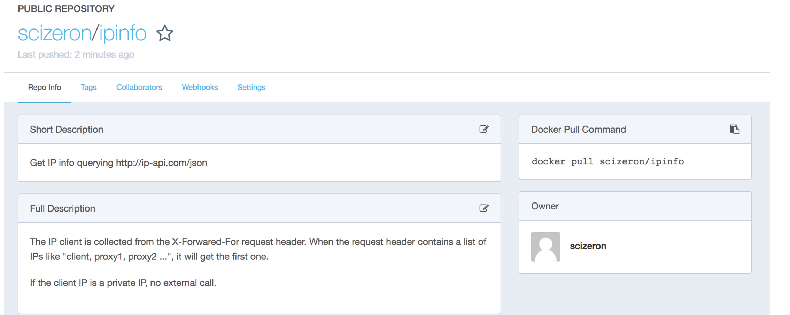

# ipinfo

## Table Of Contents
- [Build](#build)
- [Run](#run-locally)
- [Docker](#docker)

---

## build

```sh
mvn clean install
```
---
## run locally 

behind the GE proxy

```sh
java -Djava.net.preferIPv4Stack=true -Dhttp.proxyHost=$PROXY_HOST -Dhttp.proxyPort=$PROXY_PORT -jar target/app.jar  
```

To simulate a remote client (locally)

```sh
curl -H X-FORWARDED-FOR:$(curl -s icanhazip.com) http://localhost:8080
```

## docker

### build

```sh
docker build -t scizeron/ipinfo .
```

### run

behind the GE proxy

```sh
docker run -d -p8080:8080 -e "JAVA_OPTS=-Djava.net.preferIPv4Stack=true -Dhttp.proxyHost=$PROXY_HOST -Dhttp.proxyPort=$PROXY_PORT" scizeron/ipinfo
```

### push 

Push the docker image on hub.docker.com (docker login)

```sh
docker push scizeron/ipinfo
```

See all tags [here](https://hub.docker.com/r/scizeron/ipinfo/tags/).



## swarm

### service

```sh
docker service create --name ipinfo --replicas 1 --publish 8080:8080 scizeron/ipinfo
```
